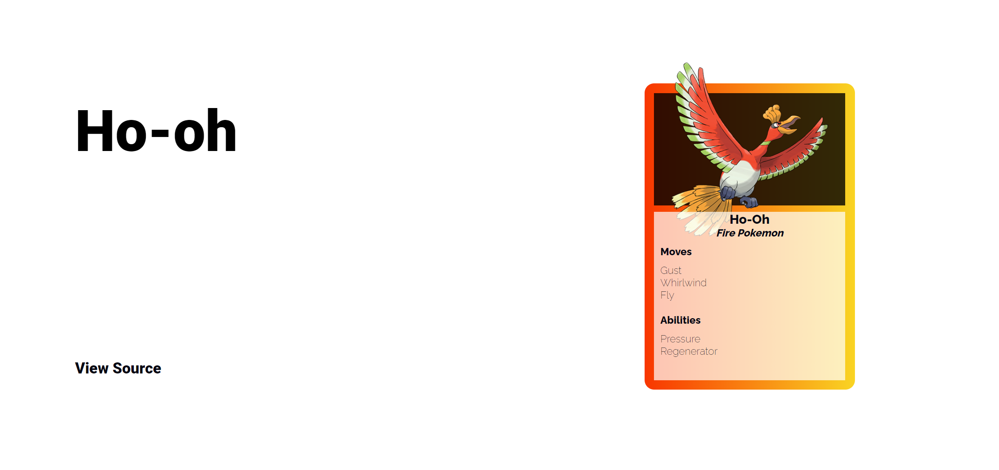

<h1 align="center">Dexter</h1>
<h5 align="center">Pokemon search made with F# and Elmish</h5>
<a href="https://github.com/rajatsharma/dexter"></a>

[](https://dex-fs.netlify.app)

## Prerequisites

- [`dotnet sdk`](https://dotnet.microsoft.com/download)
- [`node`](https://nodejs.org/en/)
- [`yarn`](https://yarnpkg.com/)

## Getting Started

- Clone the repo.

```sh
$ git clone https://github.com/rajatsharma/dexter
```

- Install dependencies.

```sh
$ yarn
$ dotnet paket update
```

## Development

- Start development server with hot reload.

```sh
$ yarn dev
```

- Open [http://localhost:4500/](http://localhost:4500/)

## Deployment

- Create production build.

```sh
$ yarn build
```

- Dexter uses netlify-cli to deploy to [Netlify](https://www.netlify.com/).

```
$ yarn deploy
```

- You can also dry run deploys using 

```
$ yarn deploy:dry
```

## License

[](https://github.com/rajatsharma/dexter/blob/master/LICENSE)
